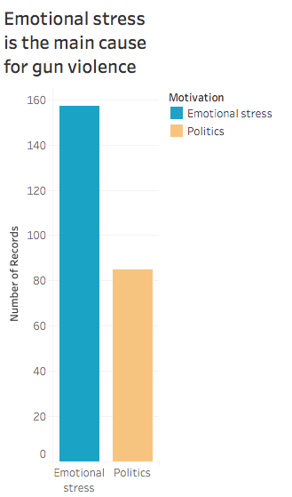

# Gun Violence Is Affecting Your Children More Than Ever!

# Team Members 
[Xinran Li](https://github.com/Cindyli0310)

[Xin Zou](https://github.com/XZou0803)  

[Chia-cheng Lin](https://github.com/82817)

[Jui-Chuan Ma](https://github.com/jma4)

# 1. Introduction
### Narrative Story
Parents, whether you support gun control or not, it is imperative for you to understand the state of gun violence in America. We looked closely at datasets containing information about mass shootings, gun deaths and school shootings. 

Our first finding is that the motivation behind 64% of mass shooting incidents are due to emotional stress. Emotional stress include reasons such as domestic dispute, anger, psychological issues and more. It is extremely dangerous when people can easily have access to guns during emotional breakdown.

In our second finding, we found that children is the biggest victim group of homicide and the smallest victim group of suicide. This is an important issue because children do not have any voice in the topic of gun control, yet, they are the group that suffers the most consequence under gun violence.

Lastly, we are seeing a trend of incline in school shootings since 1970. One possible reason is that handgun is the most used weapon and they are very easy to conceal. Classroom is a confined space which makes children extremely vulnerable. 

As a result of these findings, we urge you to carefully think about the topic of gun control. You have the power to make a difference and create a better world for our children.


### Video  
[](https://www.youtube.com/watch?v=QumyEe6pXPM&feature=youtu.be)


# 2. Revsied version with findings and analysis

### Finding 1  
The motivation behind 64% of mass shooting incidents are due to emotional stress.  


### Analysis
We found that over 64% of mass-shootings from 1966 to 2017 were due to problems such as domestic dispute, anger, and psychological issues. We categorize these problems as emotional stress of the shooter. Since guns are easy to obtain, people are able to utilize it when they experience some sort of mental breakdown. If someone exhibits dangerous behavior prior to the shooting and the motivation was emotional, we should have laws that capitalize on that window and take away gun possession from the potential shooter, especially when a lot of child victims come from these types of incidents.

### Finding 2  
Minors is the highest age group people who deaths under firearm, and the number of homocide in minors is much higher than number of suicide in minors.  


### Analysis
Our second visualization shows a terrifying fact that minor age group has a highest rate of being a victim of firearm homicide. Homicide rate is decreased when age is increasing and leads to senior citizens are more likely to die in suicide caused by a firearm. The topic we want to lead out is that the severity of gun violence impacts on United States children and teenagers. According to gun-death dataset, 58 percent are killed by gun related homicides-about 1,100 per year. Minors are not allowed to vote for firearms control and they are the largest group of gun violence victims. Parents should be aware of how gun violence affects their children and speak up for their kids. Among wealthy, industrialized countries, 91 percent of children under 15 killed by guns die in the United States, according to the National Institutes of Health. The same report found that young Americans (ages 15 to 24) are 49 times more likely to die by gunfire than their peers in other high-income countries.(Kerry Shaw, 2017)


### Finding 3  
Incidents of campus shooters has been increasing in the last three decades, handgun is the most common weapon in campus shooting.  
 

### Analysis
Originally, we looked at mass shootings in open and close areas and found that there are more shootings in closed areas. This makes sense because it is harder to escape in a confined space. The total victims numbers are much higher than outside building area. Additionally, many inside building tragedy happened in establishments such as school or church; places where minors oftenly go to. We extended this analysis to look strictly into campus shooting. We found that the number of school shootings has been increasing in the last 3 decades. Additionally, we found that handgun is the most used weapon compare to other types of firearm.

The two later graphs about school shootings are able to connect with our first finding. School is often a confined space and people are most likely to be trapped in classrooms. Handgun is the most used weapon because it is easy to conceal. The result is more shooting in schools because shooter can easily hide a gun to school and students are easy targets.

# 3. Making of documents

Finding 1:  
Rechecking the finding one graph, we found that the defination of emotional issue is not clear. Because the emotional issue can includes both positive and negative elements, we only includes negatives emotions which mentioned in the data. We rename the bar name and title to emotional stress and change bars color to more contrasted.  


Finding 2: 

* Reclearify finding result: Minors is the highest age group people who deaths under firearm, and the number of homocide in minors is much higher than number of suicide in minors.  
* We change the screenshot graph to tableau image.  


Finding 3:  
In our first version, we had a visualization we made from the Mass shooting dataset. We made a conclusion shows that people inside the buildings are more dangerous when Mass shooting occurs. However, we then found that the definition of inside and outside the buildings are not clear. Thus, our conclusion is also not persuasive.So we change this graph to our supporting idea. Below is the inside/outside building graph.  


Literature inspiration: From [Are School Shootings Becoming More Frequent? We Ran The Numbers](https://www.ideastream.org/news/are-school-shootings-becoming-more-frequent-we-ran-the-numbers) article, since the shooting at Columbine High School in April 1999 there have been 68 school shootings. From 2015 to 2018, the U.S. averaged a school shooting every 77 days.  

The first step is to import this dataset into Tableau. Since we want to see the number of shooting on campus across the years. We set the Date as Columns and Number of records as Rows. And we want to see the trend, a trend line is better for the audience to read. Then, the grid in the background is unnecessary here, so we deleted them to make the data-ink ratio higher.  

The second thing we want to figure out is how did the shooter get into the campus with weapons, and their purpose of hurt these kids. So we decided to try the Firearm Types to look deep into these shootings, and we found that there are some similar values such as “Handguns” and “Multiple Handguns”. Then we started to consider group them into several groups.  

Our first group method is grouping them into “Handguns”, “Rifles”, and “Others”. But the result turns out that “handguns”  were used the most, but “Others” became the second large group. This might cause confusion and the audience may doubt the accuracy of our dataset. So we changed the group method.  

Our final group method is grouping them into “Handguns”, “Rifles”, “Combination of Weapons” , “Shotgun” and “Others”. We decide not to change the structure of original values, just group the same ones, such as  “Handguns” and “Multiple Handguns”, and deleted the “Unknowns”. We found that handguns which are easy to conceal is the biggest killer in the shootings on campus, they cause the most number of injured and killed victims.


# 4. Data

### Dataset Discription
The first dataset contains information about [gun-deaths](https://www.kaggle.com/hakabuk/gun-deaths-in-the-us) in the US from 2012 to 2014 . This dataset includes information about gun-death in the US in the years 2012-2014. The data includes data regarding the victim's age, sex, race, education, intent, time (month and year) and place of death, and weather or not police was at the place of death.  

The second dataset is [mass shootings from 1966 to 2017](https://www.kaggle.com/zusmani/us-mass-shootings-last-50-years), it contains detailed information of 398 mass shootings in the United States of America that killed 1996 and injured 2488 people. Mass Shootings in the United States of America (1966-2017) The US has witnessed 398 mass shootings in last 50 years that resulted in 1,996 deaths and 2,488 injured. The latest and the worst mass shooting of October 2, 2017 killed 58 and injured 515 so far. The number of people injured in this attack is more than the number of people injured in all mass shootings of 2015 and 2016 combined. The average number of mass shootings per year is 7 for the last 50 years that would claim 39 lives and 48 injured per year.  

The third dataset is [K-12 School Shooting dataset](https://www.chds.us/ssdb/), the database documents each and every instance a gun is brandished, is fired, or a bullet hits school property for any reason, regardless of the number of victims, time of day, or day of the week. And we downloaded the data from 1970 to 2019(Present), 1374 records in total. Because the dataset is pretty clean, we insert the data directly into Tableau.


### gun-deaths in the US from 2012 to 2014 Description

year: The year in which the fatality occurred.  

month: The month in which the fatality occurred.

intent : The intent of the perpetrator of the crime. This can be Suicide, Accidental, NA, Homicide, or Undetermined 

police : Whether a police officer was involved with the shooting. Either 0 (false) or 1 (true)

sex : The gender of the victim. Either M or F.

age : The age of the victim.

race : The race of the victim. Either Asian/Pacific Islander, Native American/Native Alaskan, Black, Hispanic, or White.  

hispanic: A code indicating the Hispanic origin of the victim.

place : Where the shooting took place

education : Educational status of the victim. Can be one of the following: 1: Less than High School 2: Graduated from High School or equivalent 3: Some College 4: At least graduated from College 5: Not available

### mass shootings from 1966 to 2017 Discription

Location: Location where the shooting took place

Date: Date of the shooting

Open/Close Location: Inside the building or open space

Target: Possible target audience or company  

Mental Health Issues: Whether the shooter has a mental health issue

Cause: The reason causes the shooting. Terrorism, Hate Crime, Fun (for no obvious reason etc.)  

Age: Shooter's age  

Employeed (Y/N): Whether the shooter has employeed or not
 
Employed at: Shooter's employeed location

Fatalities: Total number of people deceased

Injured: Total number of people injured

Policeman Killed: Total number of policeman killed in that event

Race: Race of the shooter

Gender: Gender of the shooter

Latitude/Longtitude: Location of the event

### K-12 School Shooting Major Variables Description 
Date: The date that the shooting occurred  

Firearm Type: The firearm type that the shooter used  

Targeted Specific Victim(s): The shooting is targeted or random  

Total Injured/Killed victims: The number of total victims


### Data Clean Process


```python
import pandas as pd
import numpy as np
df_death = pd.read_csv("guns.csv")
df_mass = pd.read_csv("Mass.csv", encoding = 'ISO-8859-1')
```

### Part1-Below is the code on how we clean the data for gun-deaths in the US from 2012 to 2014 


```python
pd.options.display.max_columns = 999
```


```python
df_death.head()
```


<div>
<style scoped>
    .dataframe tbody tr th:only-of-type {
        vertical-align: middle;
    }

    .dataframe tbody tr th {
        vertical-align: top;
    }

    .dataframe thead th {
        text-align: right;
    }
</style>
<table border="1" class="dataframe">
  <thead>
    <tr style="text-align: right;">
      <th></th>
      <th>Unnamed: 0</th>
      <th>year</th>
      <th>month</th>
      <th>intent</th>
      <th>police</th>
      <th>sex</th>
      <th>age</th>
      <th>race</th>
      <th>hispanic</th>
      <th>place</th>
      <th>education</th>
    </tr>
  </thead>
  <tbody>
    <tr>
      <th>0</th>
      <td>1</td>
      <td>2012</td>
      <td>1</td>
      <td>Suicide</td>
      <td>0</td>
      <td>M</td>
      <td>34.0</td>
      <td>Asian/Pacific Islander</td>
      <td>100</td>
      <td>Home</td>
      <td>4.0</td>
    </tr>
    <tr>
      <th>1</th>
      <td>2</td>
      <td>2012</td>
      <td>1</td>
      <td>Suicide</td>
      <td>0</td>
      <td>F</td>
      <td>21.0</td>
      <td>White</td>
      <td>100</td>
      <td>Street</td>
      <td>3.0</td>
    </tr>
    <tr>
      <th>2</th>
      <td>3</td>
      <td>2012</td>
      <td>1</td>
      <td>Suicide</td>
      <td>0</td>
      <td>M</td>
      <td>60.0</td>
      <td>White</td>
      <td>100</td>
      <td>Other specified</td>
      <td>4.0</td>
    </tr>
    <tr>
      <th>3</th>
      <td>4</td>
      <td>2012</td>
      <td>2</td>
      <td>Suicide</td>
      <td>0</td>
      <td>M</td>
      <td>64.0</td>
      <td>White</td>
      <td>100</td>
      <td>Home</td>
      <td>4.0</td>
    </tr>
    <tr>
      <th>4</th>
      <td>5</td>
      <td>2012</td>
      <td>2</td>
      <td>Suicide</td>
      <td>0</td>
      <td>M</td>
      <td>31.0</td>
      <td>White</td>
      <td>100</td>
      <td>Other specified</td>
      <td>2.0</td>
    </tr>
  </tbody>
</table>
</div>


```python
df_death.isna().sum()
```


    Unnamed: 0       0
    year             0
    month            0
    intent           1
    police           0
    sex              0
    age             18
    race             0
    hispanic         0
    place         1384
    education       53
    dtype: int64


```python
len(df_death)
```


    100798


This dataset is very clean, and we have 100798 rows of data. We decided to drop the first column because it is useless and all rows that have NA because they only take up a small portion of our data


```python
df2 = df_death[df_death.isna().sum(1)==0]
```


```python
df2 = df2.drop(columns={"Unnamed: 0"})
```


```python
df2.hispanic.unique()
```


    array([100, 281, 211, 998, 261, 210, 222, 282, 260, 270, 231, 237, 200,
           223, 226, 275, 250, 234, 280, 227, 224, 286, 233, 271, 220, 225,
           235, 242, 212, 221, 239, 299, 232, 291, 217, 252, 209, 238, 218])


We already have a race column so "Hispanic" is not needed


```python
df2 = df2.drop(columns={"hispanic"})
```


```python
df2.race.unique()
```


    array(['Asian/Pacific Islander', 'White',
           'Native American/Native Alaskan', 'Black', 'Hispanic'],
          dtype=object)


```python
df2.place.unique()
```


    array(['Home', 'Street', 'Other specified', 'Other unspecified',
           'Trade/service area', 'Farm', 'Industrial/construction',
           'School/instiution', 'Sports', 'Residential institution'],
          dtype=object)


```python
df2.intent.unique()
```


    array(['Suicide', 'Undetermined', 'Accidental', 'Homicide'], dtype=object)


```python
df2.sex.unique()
```


    array(['M', 'F'], dtype=object)


```python
df2.education.unique()
```


    array([4., 3., 2., 1., 5.])


Education is a numeric value, so we decided to put the meaning of the number in the data

1: Less than High School 

2: Graduated from High School or equivalent 

3: Some College 

4: At least graduated from College 

5: Not available


```python
df2["Education"] = df2["education"].apply(lambda a: "Less than High School" if a == 1.0 else "Graduated from High School or equivalent" if a ==2.0\
                      else "Some College" if a == 3.0 else "At least graduated from College" if a == 4.0 else "Not available")
```


```python
df2 = df2.drop(columns="education")
```


```python
df2.head()
```


<div>
<style scoped>
    .dataframe tbody tr th:only-of-type {
        vertical-align: middle;
    }

    .dataframe tbody tr th {
        vertical-align: top;
    }

    .dataframe thead th {
        text-align: right;
    }
</style>
<table border="1" class="dataframe">
  <thead>
    <tr style="text-align: right;">
      <th></th>
      <th>year</th>
      <th>month</th>
      <th>intent</th>
      <th>police</th>
      <th>sex</th>
      <th>age</th>
      <th>race</th>
      <th>place</th>
      <th>Education</th>
    </tr>
  </thead>
  <tbody>
    <tr>
      <th>0</th>
      <td>2012</td>
      <td>1</td>
      <td>Suicide</td>
      <td>0</td>
      <td>M</td>
      <td>34.0</td>
      <td>Asian/Pacific Islander</td>
      <td>Home</td>
      <td>At least graduated from College</td>
    </tr>
    <tr>
      <th>1</th>
      <td>2012</td>
      <td>1</td>
      <td>Suicide</td>
      <td>0</td>
      <td>F</td>
      <td>21.0</td>
      <td>White</td>
      <td>Street</td>
      <td>Some College</td>
    </tr>
    <tr>
      <th>2</th>
      <td>2012</td>
      <td>1</td>
      <td>Suicide</td>
      <td>0</td>
      <td>M</td>
      <td>60.0</td>
      <td>White</td>
      <td>Other specified</td>
      <td>At least graduated from College</td>
    </tr>
    <tr>
      <th>3</th>
      <td>2012</td>
      <td>2</td>
      <td>Suicide</td>
      <td>0</td>
      <td>M</td>
      <td>64.0</td>
      <td>White</td>
      <td>Home</td>
      <td>At least graduated from College</td>
    </tr>
    <tr>
      <th>4</th>
      <td>2012</td>
      <td>2</td>
      <td>Suicide</td>
      <td>0</td>
      <td>M</td>
      <td>31.0</td>
      <td>White</td>
      <td>Other specified</td>
      <td>Graduated from High School or equivalent</td>
    </tr>
  </tbody>
</table>
</div>


Double check the cleaning result


```python
df2.isna().sum()
```


    year         0
    month        0
    intent       0
    police       0
    sex          0
    age          0
    race         0
    place        0
    Education    0
    dtype: int64


##### Ideas that we can explore with the gun-death dataset

- Intent of the the shooter 
- Events where the police was involved
- Education of the shooter
- Age of the shooter
- Time variable compare with all of the variables mentioned above


### Part 2-Below is the code on how we clean the data for gun-deaths in the US from mass shootings from 1966 to 2017

We were curious to see what defines as mass shootings. We investigated the total victim count but the minimum record is as low as 3 victims.


```python
df_mass['Total victims'].min()
```


    3


Even though the data contains over 50 years of data, the dataset is relatively small with only 323 rows of data. 


```python
len(df_mass)
```


    323


We believe that this is acceptable given that the nature of mass shooting events does not happen often. There are some interesting variables that we can explore with visualization such as gender, race, number of victims, and how many policeman were killed. We also have time data that we can possibly draw trends from.


```python
df_mass.isna().sum()
```


    S#                        0
    Title                     0
    Location                 45
    Date                      0
    Incident Area            62
    Open/Close Location      28
    Target                    5
    Cause                    77
    Summary                   0
    Fatalities                0
    Injured                   0
    Total victims             0
    Policeman Killed          6
    Age                     144
    Employeed (Y/N)         256
    Employed at             282
    Mental Health Issues      0
    Race                      2
    Gender                    0
    Latitude                 20
    Longitude                20
    dtype: int64


We decided to drop columns that have a lot of NAs, as well as columns that are not useful in our upcoming visualization

For the "Location", we unified them into just State Code for the better statistic.


```python
us_state_abbrev = {
    'Alabama': 'AL',
    'Alaska': 'AK',
    'Arizona': 'AZ',
    'Arkansas': 'AR',
    'California': 'CA',
    'Colorado': 'CO',
    'Connecticut': 'CT',
    'Delaware': 'DE',
    'Florida': 'FL',
    'Georgia': 'GA',
    'Hawaii': 'HI',
    'Idaho': 'ID',
    'Illinois': 'IL',
    'Indiana': 'IN',
    'Iowa': 'IA',
    'Kansas': 'KS',
    'Kentucky': 'KY',
    'Louisiana': 'LA',
    'Maine': 'ME',
    'Maryland': 'MD',
    'Massachusetts': 'MA',
    'Michigan': 'MI',
    'Minnesota': 'MN',
    'Mississippi': 'MS',
    'Missouri': 'MO',
    'Montana': 'MT',
    'Nebraska': 'NE',
    'Nevada': 'NV',
    'New Hampshire': 'NH',
    'New Jersey': 'NJ',
    'New Mexico': 'NM',
    'New York': 'NY',
    'North Carolina': 'NC',
    'North Dakota': 'ND',
    'Ohio': 'OH',
    'Oklahoma': 'OK',
    'Oregon': 'OR',
    'Pennsylvania': 'PA',
    'Rhode Island': 'RI',
    'South Carolina': 'SC',
    'South Dakota': 'SD',
    'Tennessee': 'TN',
    'Texas': 'TX',
    'Utah': 'UT',
    'Vermont': 'VT',
    'Virginia': 'VA',
    'Washington': 'WA',
    'West Virginia': 'WV',
    'Wisconsin': 'WI',
    'Wyoming': 'WY',
}
```


```python
df1 = df_mass.drop(columns = ['Age','Employeed (Y/N)','Employed at','Incident Area','S#','Title','Summary','Mental Health Issues'])
```


```python
df1["State"] = df1['Location'].apply(
    lambda location: location.split(',')[-1].strip() if isinstance(location, str) else location
)
```


```python
df1['State'] = df1["State"].apply(
    lambda state: us_state_abbrev[state] if state in us_state_abbrev else state
)
```


```python
df1 = df1.drop(columns="Location")
```


```python
df1.head(10)
```


<div>
<style scoped>
    .dataframe tbody tr th:only-of-type {
        vertical-align: middle;
    }

    .dataframe tbody tr th {
        vertical-align: top;
    }

    .dataframe thead th {
        text-align: right;
    }
</style>
<table border="1" class="dataframe">
  <thead>
    <tr style="text-align: right;">
      <th></th>
      <th>Date</th>
      <th>Open/Close Location</th>
      <th>Target</th>
      <th>Cause</th>
      <th>Fatalities</th>
      <th>Injured</th>
      <th>Total victims</th>
      <th>Policeman Killed</th>
      <th>Race</th>
      <th>Gender</th>
      <th>Latitude</th>
      <th>Longitude</th>
      <th>State</th>
    </tr>
  </thead>
  <tbody>
    <tr>
      <th>0</th>
      <td>11/5/2017</td>
      <td>Close</td>
      <td>random</td>
      <td>unknown</td>
      <td>26</td>
      <td>20</td>
      <td>46</td>
      <td>0.0</td>
      <td>White</td>
      <td>M</td>
      <td>NaN</td>
      <td>NaN</td>
      <td>TX</td>
    </tr>
    <tr>
      <th>1</th>
      <td>11/1/2017</td>
      <td>Open</td>
      <td>random</td>
      <td>unknown</td>
      <td>3</td>
      <td>0</td>
      <td>3</td>
      <td>0.0</td>
      <td>White</td>
      <td>M</td>
      <td>NaN</td>
      <td>NaN</td>
      <td>CO</td>
    </tr>
    <tr>
      <th>2</th>
      <td>10/18/2017</td>
      <td>Close</td>
      <td>coworkers</td>
      <td>unknown</td>
      <td>3</td>
      <td>3</td>
      <td>6</td>
      <td>0.0</td>
      <td>Black</td>
      <td>M</td>
      <td>NaN</td>
      <td>NaN</td>
      <td>MD</td>
    </tr>
    <tr>
      <th>3</th>
      <td>10/1/2017</td>
      <td>Open</td>
      <td>random</td>
      <td>unknown</td>
      <td>59</td>
      <td>527</td>
      <td>585</td>
      <td>1.0</td>
      <td>White</td>
      <td>M</td>
      <td>36.181271</td>
      <td>-115.134132</td>
      <td>NV</td>
    </tr>
    <tr>
      <th>4</th>
      <td>6/14/2017</td>
      <td>Close</td>
      <td>coworkers</td>
      <td>NaN</td>
      <td>3</td>
      <td>2</td>
      <td>5</td>
      <td>0.0</td>
      <td>Asian</td>
      <td>M</td>
      <td>NaN</td>
      <td>NaN</td>
      <td>CA</td>
    </tr>
    <tr>
      <th>5</th>
      <td>6/7/2017</td>
      <td>Close</td>
      <td>coworkers</td>
      <td>terrorism</td>
      <td>3</td>
      <td>0</td>
      <td>3</td>
      <td>NaN</td>
      <td>White</td>
      <td>M</td>
      <td>NaN</td>
      <td>NaN</td>
      <td>PA</td>
    </tr>
    <tr>
      <th>6</th>
      <td>6/5/2017</td>
      <td>Close</td>
      <td>coworkers</td>
      <td>unemployement</td>
      <td>5</td>
      <td>0</td>
      <td>5</td>
      <td>NaN</td>
      <td>NaN</td>
      <td>M</td>
      <td>NaN</td>
      <td>NaN</td>
      <td>FL</td>
    </tr>
    <tr>
      <th>7</th>
      <td>5/12/2017</td>
      <td>Close</td>
      <td>coworkers</td>
      <td>NaN</td>
      <td>3</td>
      <td>0</td>
      <td>3</td>
      <td>1.0</td>
      <td>White</td>
      <td>M</td>
      <td>NaN</td>
      <td>NaN</td>
      <td>OH</td>
    </tr>
    <tr>
      <th>8</th>
      <td>4/18/2017</td>
      <td>Open</td>
      <td>random</td>
      <td>racism</td>
      <td>3</td>
      <td>0</td>
      <td>3</td>
      <td>NaN</td>
      <td>Black</td>
      <td>M</td>
      <td>NaN</td>
      <td>NaN</td>
      <td>CA</td>
    </tr>
    <tr>
      <th>9</th>
      <td>1/6/2017</td>
      <td>Close</td>
      <td>random</td>
      <td>terrorism</td>
      <td>5</td>
      <td>6</td>
      <td>11</td>
      <td>NaN</td>
      <td>Latino</td>
      <td>M</td>
      <td>NaN</td>
      <td>NaN</td>
      <td>FL</td>
    </tr>
  </tbody>
</table>
</div>


```python
df1['State'].isna().sum()
```


    45


```python
df1.Cause.unique()
```


    array(['unknown', nan, 'terrorism', 'unemployement', 'racism',
           'frustration', 'domestic dispute', 'anger', 'psycho', 'revenge',
           'domestic disputer', 'suspension', 'religious radicalism', 'drunk',
           'failing exams', 'breakup', 'robbery'], dtype=object)


We simplified the race into six categories

White, African American, Asian, Latino, Native America, and Others


```python
##White
df1.replace({'Race':['White American or European American','white','White','White American or European American/Some other Race']},'White',inplace=True)
##Black 
df1.replace({'Race':['Black American or African American','Black','black','Black American or African American/Unknown']},'African American',inplace=True)
##Asian
df1.replace({'Race':['Asian American','Asian','Asian American/Some other race']},'Asian',inplace=True)
##Other
df1.replace({'Race':['Unknown','Some other race','Other','Two or more races']},'Other',inplace=True)

```


```python
df1.Race.value_counts()
```


    White                               144
    African American                     85
    Other                                66
    Asian                                18
    Latino                                5
    Native American or Alaska Native      3
    Name: Race, dtype: int64


```python
df1.head()
```


<div>
<style scoped>
    .dataframe tbody tr th:only-of-type {
        vertical-align: middle;
    }

    .dataframe tbody tr th {
        vertical-align: top;
    }

    .dataframe thead th {
        text-align: right;
    }
</style>
<table border="1" class="dataframe">
  <thead>
    <tr style="text-align: right;">
      <th></th>
      <th>Date</th>
      <th>Open/Close Location</th>
      <th>Target</th>
      <th>Cause</th>
      <th>Fatalities</th>
      <th>Injured</th>
      <th>Total victims</th>
      <th>Policeman Killed</th>
      <th>Race</th>
      <th>Gender</th>
      <th>Latitude</th>
      <th>Longitude</th>
      <th>State</th>
    </tr>
  </thead>
  <tbody>
    <tr>
      <th>0</th>
      <td>11/5/2017</td>
      <td>Close</td>
      <td>random</td>
      <td>unknown</td>
      <td>26</td>
      <td>20</td>
      <td>46</td>
      <td>0.0</td>
      <td>White</td>
      <td>M</td>
      <td>NaN</td>
      <td>NaN</td>
      <td>TX</td>
    </tr>
    <tr>
      <th>1</th>
      <td>11/1/2017</td>
      <td>Open</td>
      <td>random</td>
      <td>unknown</td>
      <td>3</td>
      <td>0</td>
      <td>3</td>
      <td>0.0</td>
      <td>White</td>
      <td>M</td>
      <td>NaN</td>
      <td>NaN</td>
      <td>CO</td>
    </tr>
    <tr>
      <th>2</th>
      <td>10/18/2017</td>
      <td>Close</td>
      <td>coworkers</td>
      <td>unknown</td>
      <td>3</td>
      <td>3</td>
      <td>6</td>
      <td>0.0</td>
      <td>African American</td>
      <td>M</td>
      <td>NaN</td>
      <td>NaN</td>
      <td>MD</td>
    </tr>
    <tr>
      <th>3</th>
      <td>10/1/2017</td>
      <td>Open</td>
      <td>random</td>
      <td>unknown</td>
      <td>59</td>
      <td>527</td>
      <td>585</td>
      <td>1.0</td>
      <td>White</td>
      <td>M</td>
      <td>36.181271</td>
      <td>-115.134132</td>
      <td>NV</td>
    </tr>
    <tr>
      <th>4</th>
      <td>6/14/2017</td>
      <td>Close</td>
      <td>coworkers</td>
      <td>NaN</td>
      <td>3</td>
      <td>2</td>
      <td>5</td>
      <td>0.0</td>
      <td>Asian</td>
      <td>M</td>
      <td>NaN</td>
      <td>NaN</td>
      <td>CA</td>
    </tr>
  </tbody>
</table>
</div>


We decided to leave NAs on some columns because it does not affect the drawing of our visualization. Also, since our dataset is small, it will affect our dataset dramatically. 


```python
df1.isna().sum()
```


    Date                    0
    Open/Close Location    28
    Target                  5
    Cause                  77
    Fatalities              0
    Injured                 0
    Total victims           0
    Policeman Killed        6
    Race                    2
    Gender                  0
    Latitude               20
    Longitude              20
    State                  45
    dtype: int64


##### Ideas that we can explore with the mass shooting dataset

- Location of the event, along with numbers of victims that are injured and deceased
- Number of victims that are injured and deceased over time
- How many Policeman was killed
- Count of the race and gender of the shooter over time


# 5. Summary

### Limitations

* The data range of Gun-deaths in the US from 2012 to 2014 dataset is very limited, only contains three years information. If we can find more years data, the finding result is more persuasive.  

* Three of our graphs use bar chart because it is the best way to explain the finding. We figure bar charts could best express our ideas about firearm violence.

* K-12 dataset contains tremendous information that we did not explore due to constraints of time and project layout.

### Suggestions

In order to decrease minors' injury number from gun violence, here are two different side suggestions to parents based on the article "Keeping Our Schools Safe: A Plan to Stop Mass Shootings and End Gun Violence in American Schools":  

**Suggestion 1**: Parents suggestions to schools
a. Establishing threat assessment programs in schools to understand and intervene whether students are a risk to themselves or others.
b. Implementing basic security upgrades to prevent access to schools and classrooms. (Ex. metal detectors)
c. More situation rehearsal for emergencies so staff can immediately lock out schools and law enforcement can respond quickly.
d. Establishing safe and equitable campus to reduce gun violence impacting on children, especially in high-risk communities.
e. Building a supportive school environment. Instead of hardening the school, it is better to lower the background levels of bullying and discrimination and track the data and perform threat assessments on potential risks.

**Suggestion 2**: Parents suggestions to gun control group
a. Pass Red Flag Laws. Red Flag laws is that law enforcement and family members can act on warning signs of violence, like those that repeatedly occurred in Parkland, and temporarily prevent access to firearms;
b. Encourage and propagandize responsible firearm storage
c. Raise the firearms sales tax and establish a safe campus program that uses part of sales tax generating from gun sales to support the program expenses.


# 6. References  
1. Lopez, German. "2018 was by far the worst year on record for gun violence in schools." VOX, 
     www.vox.com/2018/12/10/18134232/gun-violence-schools-mass-shootings. 

2. "Keeping Our Schools Safe: A Plan to Stop Mass Shootings and End Gun Violence in American Schools." 
     Everytown for Gun Safety Support Fund, https://everytownresearch.org/reports/keeping-schools-safe-plan-stop-mass-shootings-end-gun-violence-american-schools/

3. Kerry Shaw, "14 Facts That Show How Gun Violence Affects American Kids",https://www.thetrace.org/2017/07/gun-violence-america-children-kids-facts/


# 7. Tableau Link


```python

```
